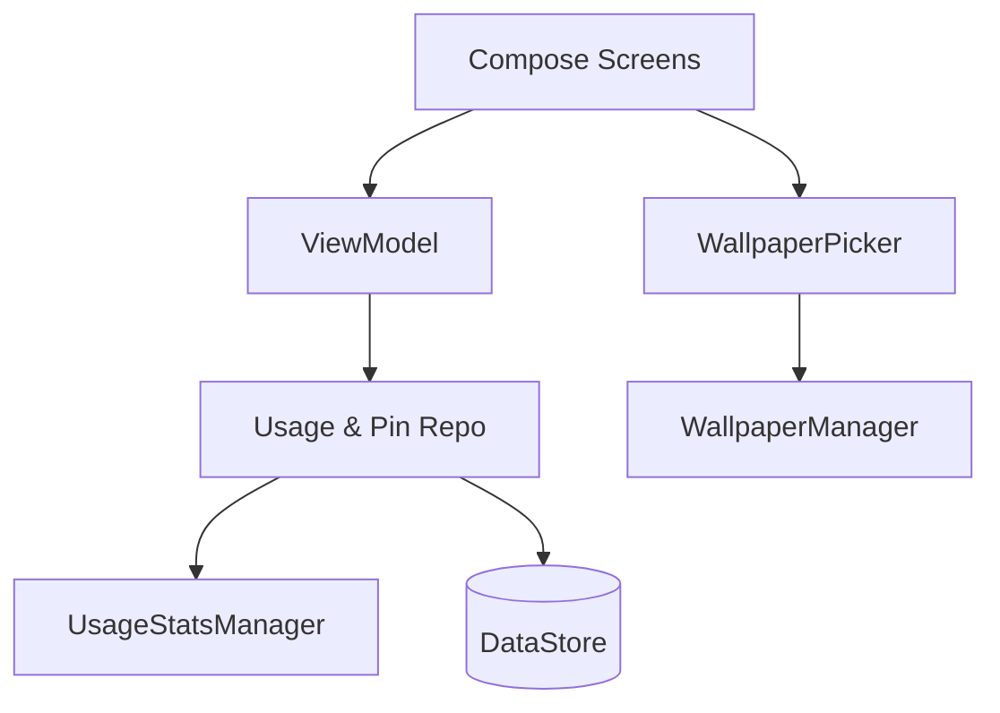

# Revy Launcher – Project Specification

*Last updated: 12 Jul 2025*

---

## 1  Overview

| Item               | Value                                                                                    |
| ------------------ | ---------------------------------------------------------------------------------------- |
| **Working title**  | **Revy**                                                                                 |
| **Purpose**        | Surface the apps you opened **most recently**, instantly, with zero manual organisation. |
| **Primary user**   | You (and like‑minded minimalists who trust recency more than folders).                   |
| **Target devices** | **Phones only**, API 34 (Android 14+)                                                    |
| **Business model** | Free, open‑source (MIT)                                                                  |
| **Distribution**   | Direct APK builds from the repo (no Play/F‑Droid for v1)                                 |

---

## 2  Core Functional Requirements

| #       | Requirement                     | Key Notes / Acceptance Criteria                                                                                                                                                                                                                                                                                                                                                                           |
| ------- | ------------------------------- | --------------------------------------------------------------------------------------------------------------------------------------------------------------------------------------------------------------------------------------------------------------------------------------------------------------------------------------------------------------------------------------------------------- |
| **F‑1** | **Recency‑sorted grid**         | Use `UsageStatsManager` (requires Usage Access). Sort descending, most recent at top‑left.                                                                                                                                                                                                                                                                                                                |
| **F‑2** | **Recency buckets**             | Divide the recency list into natural buckets: **Today** (0–24 h), **Yesterday** (24–48 h), **This week** (48 h–7 d), and **Older** (>7 d). Each bucket is rendered in the same grid, separated by a bucket header. **Apps keep a stable position within their current bucket**; they only jump when they cross a bucket boundary, preserving muscle memory. Bucket headers remain visible when scrolling. |
| **F‑3** | **Pinning**                     | Long‑press → “Pin to top”. Pinned strip appears above the recency list **and on every widget page**, so pinned apps and widgets are always visible together on the **same pager tab**. Persist order via `DataStore`.                                                                                                                                                                                     |
| **F‑4** | **Name filter**                 | Pull‑down or search icon → `TextField`; live filter by app label. Debounce < 16 ms.                                                                                                                                                                                                                                                                                                                       |
| **F‑5** | **Multiple pages**              | Horizontal swipe via Compose `Pager`. Page 1 = app grid; Page 2…n = widget pages. The pinned strip is shared across all pages.                                                                                                                                                                                                                                                                            |
| **F‑6** | **Widgets**                     | Host standard App Widgets on non‑grid pages. Support resize/move; persist layout JSON. Widgets share the same page as the pinned strip, ensuring continuity between pinned apps and widget content.                                                                                                                                                                                                       |
| **F‑7** | **App‑shortcut & context menu** | Match One UI: long‑press app for shortcuts, “App info”, “Uninstall”.                                                                                                                                                                                                                                                                                                                                      |
| **F‑8** | **Wallpaper picker**            | In settings → “Wallpaper”. Launch Android Photo Picker → user selects image from gallery. Optional crop/scale preview, then set as **home‑screen wallpaper only** using `WallpaperManager#setBitmap`. No extra permissions needed on API 34 (Photo Picker).                                                                                                                                               |

---

## 3  Out‑of‑Scope

- Icon packs / advanced theming beyond One UI colour palette
- Tablets, foldables, TVs\

## 4  Architecture

- **Language / UI**: Kotlin + Jetpack Compose
- **Entry**: Single‑Activity `MainActivity` hosting `NavHost`
- **State**: `ViewModel` + Kotlin Flow; `DataStore` (Proto) for prefs
- **Recency Provider**: Repository wrapping `UsageStatsManager`
- **DI**: Hilt
- **Wallpaper Picker Flow**: Compose screen → `ActivityResultLauncher<PickVisualMediaRequest>` (Photo Picker) → optional crop via `CropImageContract` → `WallpaperManager` service

---

## 5 UX / UI Guidelines

| Aspect               | Spec                                                                           |
| -------------------- | ------------------------------------------------------------------------------ |
| **Look & feel**      | Mirror Samsung One UI: large header, rounded icons, 4×5 grid (portrait)        |
| **Colour**           | Material You dynamic colours when available, else One UI palette               |
| **Navigation**       | System gesture/nav bar untouched; horizontal swipe switches pages              |
| **Search**           | Pull‑down gesture opens search; back press dismisses                           |
| **Wallpaper Picker** | Settings sheet with live preview; confirm or cancel. Fade transition on apply. |
| **Haptics**          | Light vibration on pin/unpin                                                   |
| **Animations**       | `animateContentSize()` on resort; blur/fade on wallpaper change                |

---

## 6 Permissions & Security

| Permission                           | Why                                                              | Handling                                     |
| ------------------------------------ | ---------------------------------------------------------------- | -------------------------------------------- |
| `PACKAGE_USAGE_STATS`                | Recency data                                                     | Block‑until‑granted onboarding screen        |
| *(none)*                             | Wallpaper via Photo Picker needs no runtime permission on API 34 | Use `ACTION_PICK_IMAGES` or Photo Picker API |
| `REQUEST_DELETE_PACKAGES` (optional) | Enable “Uninstall”                                               | Ask only when needed                         |

---

## 7 Risks & Mitigations

| Risk                          | Impact            | Mitigation                                |
| ----------------------------- | ----------------- | ----------------------------------------- |
| OEM default‑launcher lock‑ins | User can’t switch | Clear “Set as default” UI                 |
| Usage Access denial           | Core list fails   | Block‑until‑granted screen                |
| Future API changes            | Medium            | Track Android releases; update compileSdk |

---

